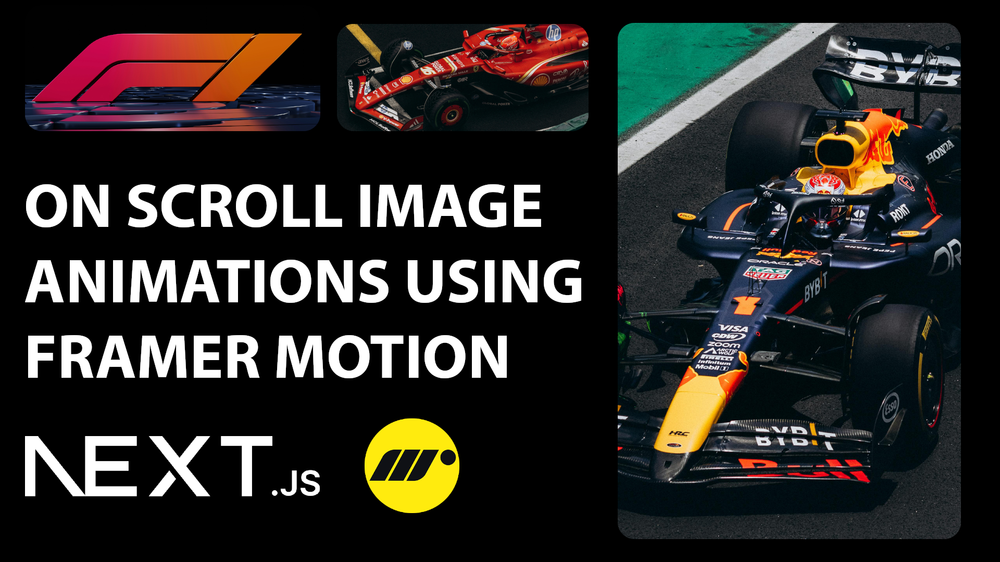

# On-Scroll Image Animations in Next.js using Framer Motion – Step-by-Step Tutorial!

🚀 Learn how to create stunning on-scroll image animations using Next.js and Framer Motion!
In this quick and easy tutorial, we'll walk through how to bring your UI to life with smooth scroll-based animations. Whether you're a beginner or looking to polish your frontend skills, this video will help you create an interactive and modern user experience using two powerful tools: Next.js and Framer Motion.

📌 What you'll learn:

Setting up Framer Motion in a Next.js project

Creating scroll-triggered image animations

Best practices for smooth and responsive effects